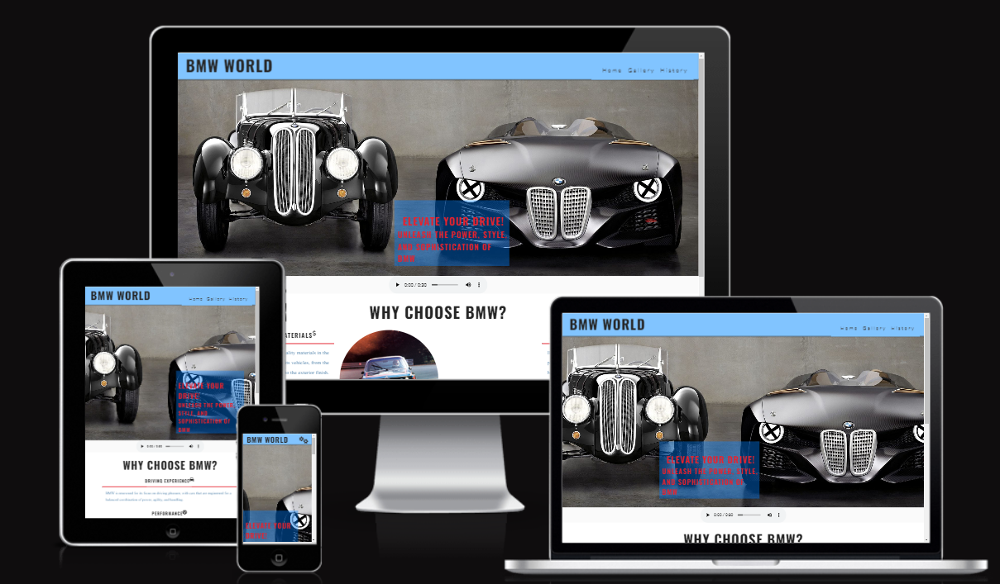
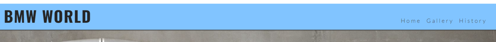
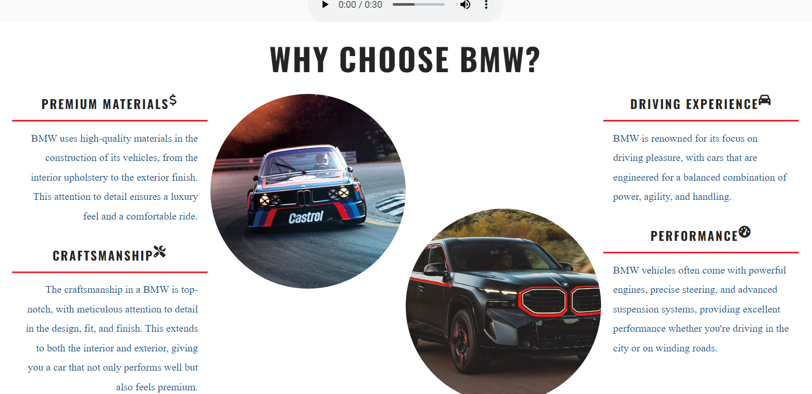
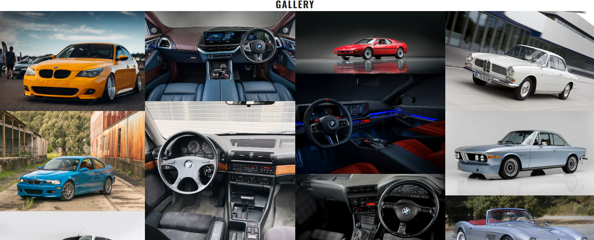
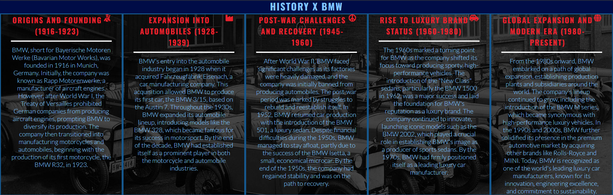
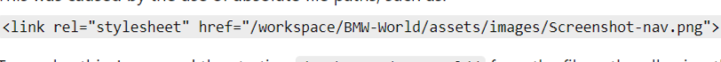
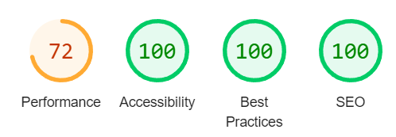

# BMW WORLD

#### The BMW WORLD website is an in-depth exploration of the iconic German automaker's legacy, from its inception to its present-day innovations. BMW WORLD offers fun facts and insights into BMW's racing heritage and design philosophy. Additionally, the website highlights the company's technological advances, like its development of electric and hybrid vehicles, and its commitment to sustainability.

#### The site begins with BMW's founding in 1916, when the company focused on aircraft engines, and trace its evolution into a luxury automotive brand. The production of BMW's first motorcycles in the 1920s and the shift to car manufacturing in the 1930s were major milestones.

## Features
- **Navigation**

  - *Featured at the top of the page, the navigation shows the websites name in the left corner: **BMW WORLD** that links to the home page.*

  - *The other navigation links are to the right, Home, Gallery and History which link to different pages.*

  - *The navigation resembles a gear cog icon when viewed on a mobile phone. The font used contrasts well with the background.*

  - *The navigation is clear to understand and tells the user the name of the website whilst making it easier to navigate through the different pages.*

- **The Header**

  - *The header shows the name of the website, using the light blue color. I've gone with the **BMW** Msport color scheme: light blue, navy blue and red.*

  - *The header indicates to the user that the website is soley about **BMW**.*

  - *This area shows the user clear information about what the site is and where to navigate to.*

- **Home Page**

  - *The Home page section gives you an option to listen to the raw engine sound of **BMW's** iconic naturally aspirated V8 engine.*

  - *This section also includes interesting information about BMW and what they offer that not many people know about. This is to show that BMW is no ordinary car manufacturer. If you want to feel special you **MUST** drive **BMW**.*

- **Gallery Page**

  - *The gallery page offers users a chance to explore a curated collection of BMW vehicles from throughout the brand's rich history.*

  - *From timeless classics to the latest modern designs, this section is designed to inspire, showcasing the evolution of BMW's automotive excellence.*

- **History page**

  - *The history page takes users on a journey through BMW's legacy, highlighting the milestones, innovations, and iconic vehicles that have shaped the brand over the decades.*

  - *Explore the evolution of BMW, from its early beginnings to its present-day achievements, and discover the stories behind the cars that defined an era.*

  - *Discover how BMW evolved from its early beginnings to become a global leader in automotive engineering and design.*

### Testing

  - **Cross-Browser Compatibility:** The page has been tested and functions properly across major browsers, including Chrome, Firefox and Safari.

  - **Responsiveness:** Using the devtools device toolbar, i confirmed that the project is fully responsive, looks visually appealing, and functions seamlessly across all standard screen sizes.

  - **Content Accessibility:** The navigation, "Home", "Gallery" and "History" text are all clear, readable, and easy to understand.

  - **Audio Recording:** I have confirmed that the embedded audio recording functions perfectly, with clear playback and responsive contols.

### Bugs

#### Solved bugs

  - Upon deploying my project to GitHub Pages, i encountered an issue where the links to CSS files and images were broken.

  - This was caused by the use of absolute file paths, such as:
  

  - To resolve this, I removed the starting **"/workspace/BMW-World/"** from the file paths, allowing the resources to load correctly.

### Validator Testing

  - **HTML**

    - The code was successfully validated with no errors when tested using official W3C validator.

  - **CSS**

    - The CSS passed through the official W3C jigsaw validator without any errors.

  - **Accessibility**

    - I ensured the project's color scheme and fonts are accessible and easy to read by running an accessibility audit using Lighthouse in DevTools.

      

### Unfixed Bugs

No unfixed bugs

## Deployment

  - The site was successfully deployed to GitHub Pages. The deployment steps are as follows:

    - In the GitHub repository, navigate to the **Settings** tab.

    - Under the **Source** section, select **Master Branch** from the drop-down menu.

    - After selecting the master branch, GitHub Pages generates a link to the live site.

The live link can be found here - [BMW WORLD](https://tirths101.github.io/BMW-World/)

## Credits

### Content

  - The code for the social media links was adapted from the **Cl Love Running Project**

### Media

  - The header image was sourced from Google Images.